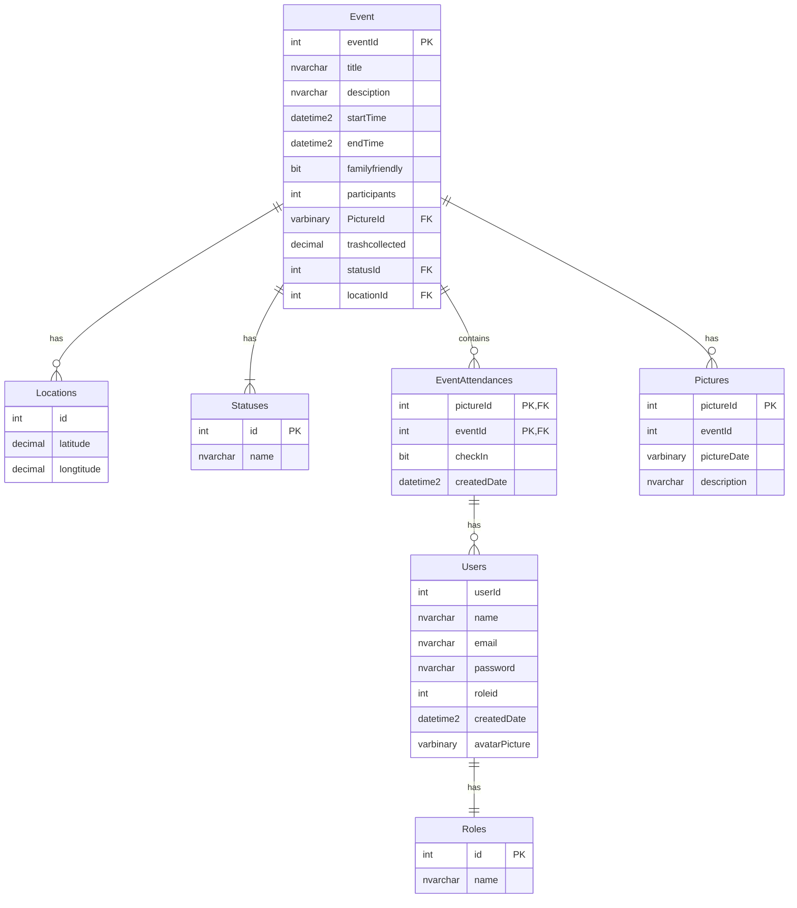

# Backend

## Entity Relationship Diagram

```mermaid
erDiagram
users["Users"] {
    int userId
    nvarchar name
    nvarchar email
    nvarchar password
    int roleid
    datetime2 createdDate
    varbinary avatarPicture
}

locations["Locations"] {
    int id
    decimal latitude
    decimal longtitude
}

roles["Roles"] {
    int id PK
    nvarchar name
}

statuses["Statuses"] {
    int id PK
    nvarchar name
}

event["Event"] {
    int eventId PK
    nvarchar title
    nvarchar desciption
    datetime2 startTime
    datetime2 endTime
    bit familyfriendly
    int participants
    varbinary PictureId FK
    decimal trashcollected
    int statusId FK
    int locationId FK   
}

eventAttendances["EventAttendances"] {
    int pictureId PK, FK
    int eventId PK, FK
    bit checkIn
    datetime2 createdDate
}

pictures["Pictures"] {
    int pictureId PK
    int eventId
    varbinary pictureDate
    nvarchar description
}

eventAttendances ||--o{ users : "has"
event ||--o{eventAttendances : "contains"
users ||--|| roles : "has"
event ||-- |{ statuses : "has"
event ||--o{ locations : "has"
event ||--o{ pictures : "has"

```
